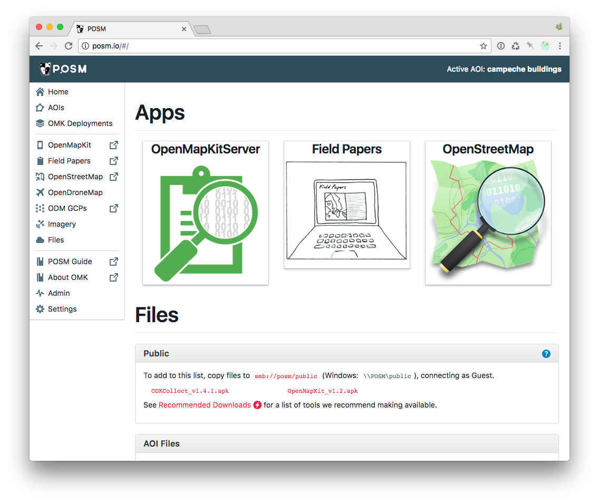

# Cloud Installation

Interested in running POSM in the cloud? This type of setup is great for semi-connected instances when you want the integration of OpenMapKit/Field Papers/OSM but have more regular connectivity with your surveyors.

First, this guide will walk through how to set things up in Amazon Web Services, specifically EC2. If you like another flavor or cloud services such as Azure, this process will still work but may look slightly different. This guide will also *not* show you how to get an AWS account, they already have great [documentation](http://docs.aws.amazon.com/AWSEC2/latest/UserGuide/EC2_GetStarted.html).

## Get a Fully Qualified Domain Name

Before installation, you should choose a domain name and host to use to access your new POSM and configure it with your DNS provider. If you don't do this, you won't be able to access the OpenStreetMap interface.

Create the subdomain `osm.example.org` . You'll configure the DNS later.


## Instance Setup

The first thing you will need to do is start a new instance. In your AWS EC2 Dashboard click on Launch instance. Scroll all the way down and find Ubuntu 14.04 LTS. The posm-build process only works on Ubuntu 14.04 at this time.


After selecting your instance type you'll need to fill out a couple more things. Below are the recommended specs.


Recomended specs for your intance are:
 * Ubuntu 14.04 ***mandatory***
 * At least 2GB RAM, 8GB+ preferred
     * If you use less than 8GB, you will not be able to run the OSM part of POSM. OpenMapKit Server runs happily on 2GB.
     * If using SuperPOSM (OpenDroneMap), the more RAM the better
 * At least 10GB of attached storage
     * Not an issue unless you have lots of photos or will be processing OpenDroneMap images
 * Open ports 22 and 80
     * 22 is needed to SSH into the server for administration and setup
     * 80 is needed to view the various resources
 * Our internal instance runs on a t3.medium with 8GB of RAM

## Configure DNS

After the instance is created, also create an elastic IP and assign it to the instance you just created. AWS has a [great guide](http://docs.aws.amazon.com/AWSEC2/latest/UserGuide/elastic-ip-addresses-eip.html#working-with-eips) for this.

Now configure the DNS. Create an @ record and point it to the IP address that you just created and assigned to your instance.

Sample DNS records:

```
my-posm.example.org     A     1.2.3.4
osm.my-posm.example.org CNAME posm.example.org
```

## POSM Cloud Install

POSM Cloud uses posm-build to install because the live ubuntu instance for physical devices doesn't work. The process take a little longer and requires a little bit of command line knowledge.


To configure POSM on your cloud host, [connect to it](http://docs.aws.amazon.com/AWSEC2/latest/UserGuide/AccessingInstancesLinux.html) using `ssh` and run the following commands.

```bash
# become root
sudo -i

# update instance for security patches
apt-get install update && apt-get install upgrade

# install git if necessary
apt update && apt install --no-install-recommends -y git

# clone this repository
git clone https://github.com/AmericanRedCross/posm-build

# edit your settings (posm_hostname, posm_domain)
vi posm-build/kickstart/etc/settings

```

The important things to edit are *posm_hostname* and *posm_domain*. Set these equal to your hostname and domain that your purchased earlier. You can comfortably ignore all the wifi settings.

If you are not comfortable with editing files via command line here is a quick guide to using [vi](https://www.cs.colostate.edu/helpdocs/vi.html). The important thing is to hit ``i`` to edit and then after making changes hit ``ESC`` and then ``:`` and type ``wq`` to "write and quit"


The last thing is to install everything. This will take a while; go get a snack and come back.

```
/root/posm-build/kickstart/scripts/bootstrap.sh base virt nodejs ruby gis mysql postgis nginx osm fieldpapers omk tl carto tessera admin
```
The above command will install everything needed to run POSM Cloud but *will not install* OpenDroneMap.

To add SuperPOSM capabilities (OpenDroneMap + GeoTIFF processing), use the following instead.

```
/root/posm-build/kickstart/scripts/bootstrap.sh base virt nodejs ruby gis mysql postgis nginx osm fieldpapers omk tl carto tessera admin docker redis opendronemap imagery
```

## OMK Server Settings

OpenMapKit server does not apply authintification out of the box; you will need to set it up to ensure that sensitive information cannot be viewed on your cloud instance. This step requires more command line knowledge.

If the POSM cloud install was succesful, then you should now be able edit your OMK server settings. You will need to uncomment the lines starting with "auth" and add in the credentials you would like.

```
sudo vi /opt/omk/OpenMapKitServer/settings.js
```

Your screen should looks something like this. **Notice the added comma after the last `}` for osmApi**


After saving, just reboot your server and authentication should be working when you go to OMK Server.

## Success

After everything is configured you can go to your domain and you should see the following screen.


