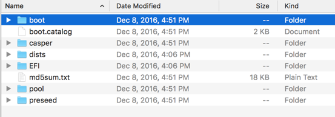
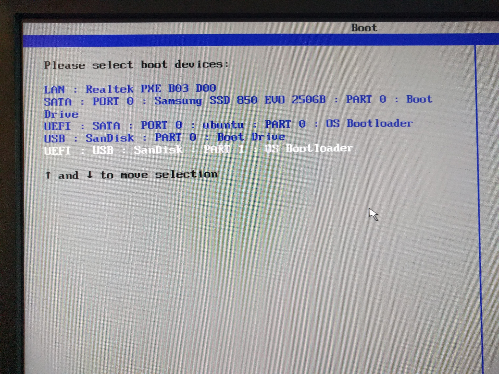

Interested in getting a POSM? This involves a little bit of DIY, but advanced
tech skills are **not** required. This site has instructions that walk through
the whole process.

First, you order the hardware kit (you'll have to assemble a few things). Next,
you load the core software onto the device for a first-time install. This
transforms the unit into a POSM. After that, the POSM is ready to go and can be
used over and over again.

## Anatomy of a POSM

### Hardware

We used the following hardware components for the original version of POSM,
which cost about $300 in total:

* [Intel NUC Kit - BOXNUC5PPYH](http://smile.amazon.com/gp/product/B00XPVQHDU) -
  2.6 GHz quad core Pentium (N3700, 6W TDP). It includes a basic case.
* [Samsung 850 EVO 250GB](http://smile.amazon.com/gp/product/B00OAJ412U)
* [8GB 1600MHz DDR3L CL9 SODIMM](http://smile.amazon.com/gp/product/B00KQCOTCM)
* [Wireless N Dual Band + Bluetooth 4.0 M.2 NGFF Combo
  Card](https://www.thinkpenguin.com/gnu-linux/wireless-n-dual-band-bluetooth-40-m2-ngff-combo-card) -
  This is needed if you plan to have more than 14 devices connected at a time.
  Replace the stock wireless card with this.

If you want to be able to use OpenDroneMap with POSM, then you will
want slightly more souped-up hardware with greater processing power.
Instead of the NUC unit above, order the following, somewhat more expensive
model:

* [Intel NUC kit - NUC6i7KYK](https://smile.amazon.com/gp/product/B01DJ9XS52)

### Software

Once you've ordered and assembled the components, you'll load the device with a
core software package that transforms it into a POSM. The package includes the
core POSM software, all of the tools that POSM supports, and other
downloads/apps to support mapping and mobile data collection.

The POSM download is
[here](https://posm.s3.amazonaws.com/releases/posm-0.7.1.iso) and instructions
are in the following section.

For developers: the POSM software is free, open-source, and available through
the [POSM GitHub organization](https://github.com/posm) with technical
documentation and a variety of other resources. If you want more technical info
or a less GUI-oriented means of setting this up, then head over to GitHub.

### Other things you will need

The POSM hardware is a mini-computer. To set it up for the very first time,
you'll need to plug in the following:

* USB keyboard
* external monitor or TV with an HDMI input
* USB stick (minimum 4 GB)

You'll also need an internet connection with an ethernet cable to load an area
of interest onto the POSM and set it up for the field.

## First-time install

First, download the [core POSM
software](https://posm.s3.amazonaws.com/releases/posm-0.7.1.iso). This will
download with the file name `posm-0.7.1.iso`. You need to move that onto a USB
stick and extract it into a set of folders, but first you'll have to change the
USB formatting (UEFI booting is the technical term for what's being
facilitated).

### Configuring the USB stick

#### Mac

On a Mac, plug in your USB stick and open Disk Utility. Navigate to the USB
stick and click "Erase".

Give the USB stick a name. Set the format to `MS-DOS (FAT)` and the scheme to
`GUID Partition Map`. Then click "Erase", which will delete all existing files
and reformat the drive to make it compatible with the POSM. See below:

#### Windows

On a PC, connect the USB drive, then go to "Computer" or "My Computer",
right-click the drive and select "Format…" from the menu. Set the drive to FAT.

### Moving and extracting the POSM download (AKA "ISO file") onto the USB stick

If you don't use command line, then moving the POSM download bundle involves
downloading a file extractor to extract it (we use [The
Unarchiver](https://itunes.apple.com/us/app/the-unarchiver/id425424353?mt=12)
for Mac or [7-Zip](http://www.7-zip.org/) for Windows).

On a Mac, open The Unarchiver and navigate to the `Extraction` tab. Where it
says "Create a new folder for the extracted files", select `Never`. The reason
we do this is because the POSM download has to be extracted and moved onto the
USB stick. Most file extractors will place extracted files into an overall
folder. The POSM unit can't handle this, and you can't just manually move
everything one level up because there are hidden files that will get missed.

Use your extraction client (The Unarchiver or 7-Zip) to extract the download
(`posm-0.7.1.iso`) onto the USB stick... again, making sure that the files do
not end up in an overall folder. On a Mac, you do this by right-clicking the
`posm-0.7.1.iso` file and selecting `Open with...` ... `The Unarchiver`. Set the
destination folder to the USB stick and press "Extract".

The contents of your USB stick should look like this:

### POSM first-time install

Alright, you're finally ready. Take the Intel NUC unit that you've assembled and
plug in an external monitor, a keyboard, and the USB stick you've prepared. Turn
the power on.

You’ll see a dark boot screen appear on your monitor with the Intel NUC logo and
a few options in the bottom-right corner. Press F10 when prompted. You’ll have
to be quick on the draw with this because the prompt only lasts a few seconds.
If you miss it, then just turn the power off and try again.

This will open a menu (see below) where you have to select which device to boot
from. Use the arrow keys to select your USB stick, then hit enter.

You'll be prompted by a screen that says GNU GRUB at the top and asks if you
want to do an automated install. You do. You can also wait 10 seconds and it
will take matters into its own hands.

That’s it. The software will install onto the NUC unit, transforming it into a
POSM. This can take several minutes. When it’s complete, you’ll be prompted with
a screen asking you for login credentials. You can log in if you want. The
username is `root` and password is `posm`.

Finally, the screen will look like this when the whole process is complete. You
can now power-down the POSM, disconnect the USB stick and keyboard and monitor.
It is set up and ready for use.

![][logged-in.png]

Reminder: you only need to do this the very first time you take your POSM out of
its cardboard box and set it up (or upgrade the core POSM software). After that,
it's just a matter of loading areas of interest and creating deployments.

Note: if you ever want to wipe and reinstall the core POSM software (to install
a new version, etc), then it's the same process - prep the USB stick, plug in
the monitor etc, and press `F10` when prompted. The NUC unit will overwrite the
existing installation with new software from the USB stick.
