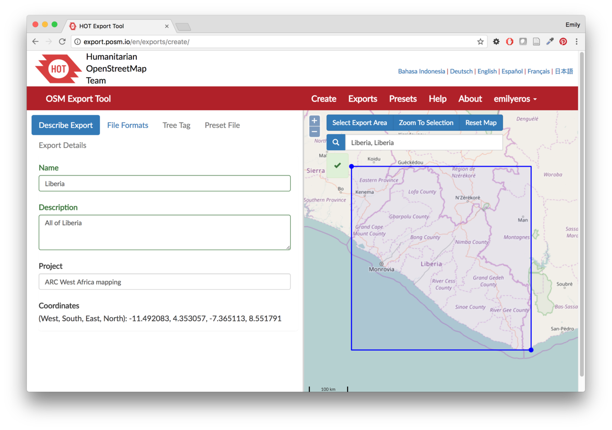
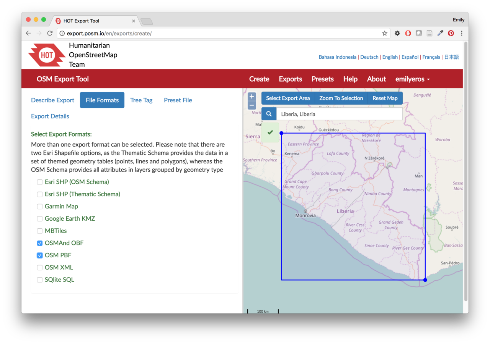
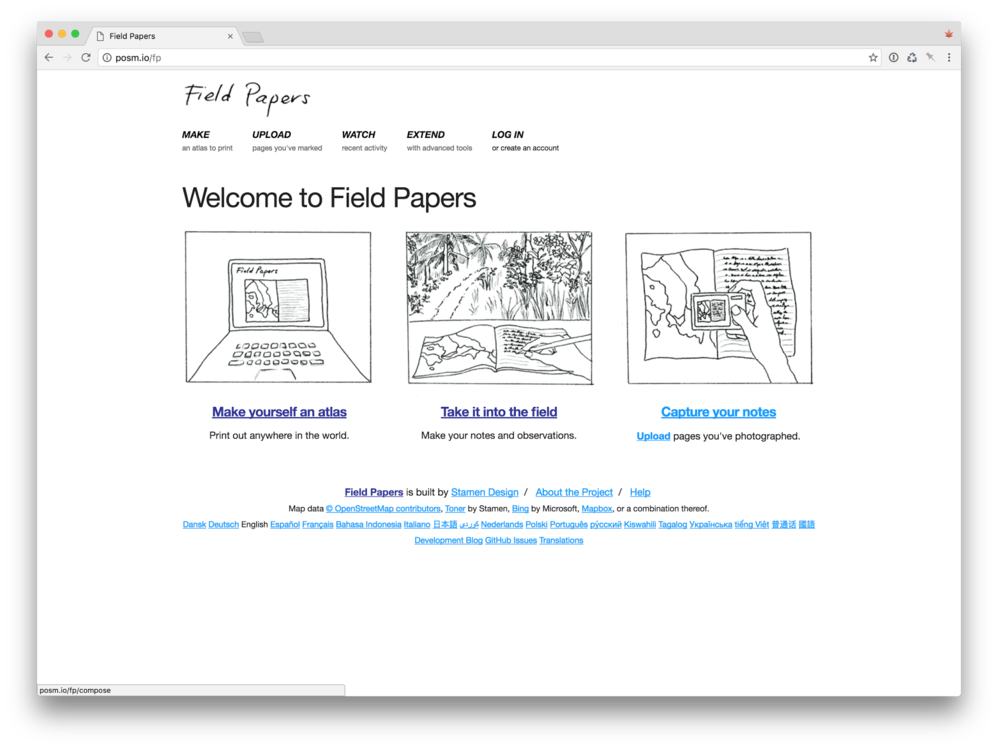
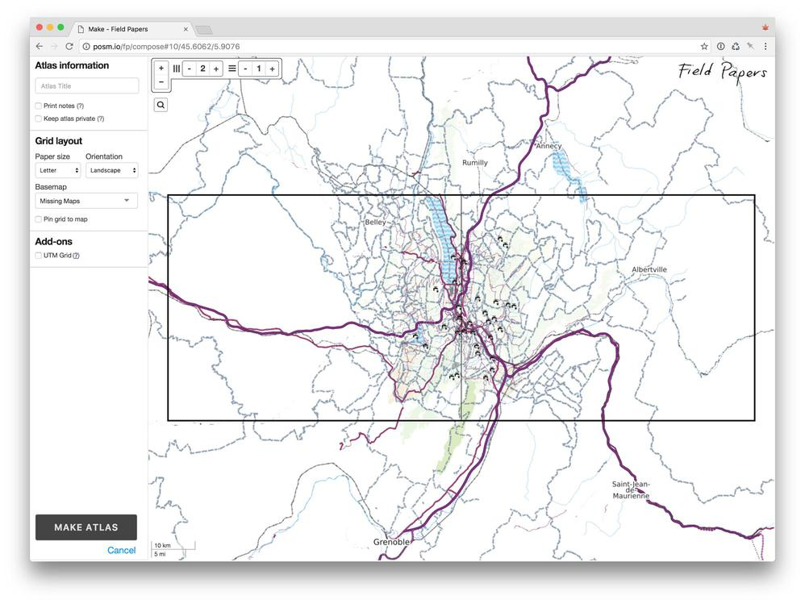
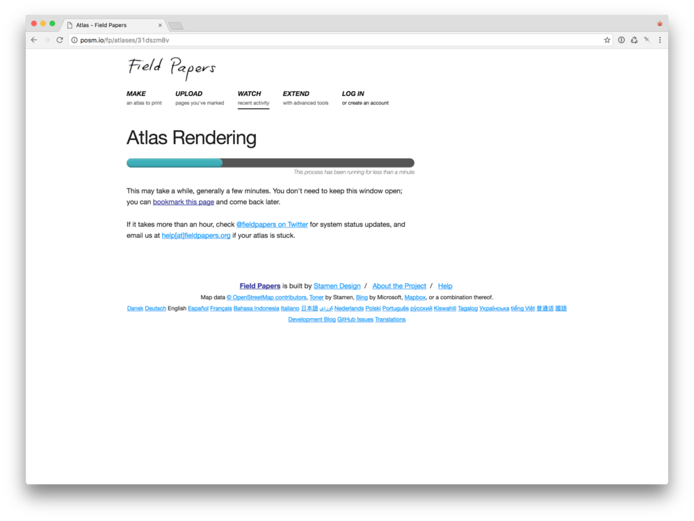

Now you have a POSM. The device has all the core software ready to go, and the
next step is to create a "deployment" - this means downloading all the
OpenStreetMap data and other resources for your area of interest (AOI). You
should do this in an area with a stable internet connection - if you are
traveling for fieldwork, we highly recommend doing this before you leave. POSM
can handle relatively large deployments (entire districts and sometimes
countries).

## Creating an AOI deployment

On your computer, when connected to the internet, navigate in your browser to
[the POSM export tool](http://export.posm.io/en/). This site will allow you to
select a geographic area and extract the OSM-related data you need for it.

First, long in with your OpenStreetMap credentials. You'll arrive by default at
the "Create" page. You can set the area by searching for a place, by geographic
coordinates, or by zooming in on the map and physically drawing a box around
your project area.

Once you've entered in some basic project info on the left side of the screen,
then click on "File Formats" in the navigation menu.

This tool was designed to enable a variety of mapping analysis and data uses, so
you won't need to check all the boxes - **all that's required for POSM is the
OSM PBF file** (the OSMAnd OBF is also highly recommended). But just in case,
here's a run-down of what your options are and what you might use them for if
you do want extra data available offline:

* Esri SHP (OSM Schema): Standard shapefile used by most GIS applications. This
  extracts all OSM data into three shapefiles (point, line, and polygon)
* Esri SHP (Thematic Schema): Standard shapefile used by most GIS applications.
  This extracts the OSM data into many shapefiles (e.g. waterways, buildings,
  health/schools, residential landuse areas, airports, amenity points, etc).
  This is probably more useful if you are building a base map or need basic GIS
  data layers for the area.
* Garmin Map: For loading onto GPS devices
* Google Earth KMZ: For loading into Google Earth. Often used for tracks.
* MBTiles: Background map tiles for offline use. Extracting these will allow you
  to host offline mapathons with the HOT tasking manager. Check this box and
  enter the Bing API when prompted:
  `https://ecn.t2.tiles.virtualearth.net/tiles/a{q}.jpeg?g=587&mkt=en-gb&n=z`.
  Make sure the `{q}` copies and pastes properly - it sometimes gets replaced
  with other characters. Once you've pasted the link, you'll also need to set
  the minimum and maximum zoom levels; we recommend 13 to 20.
  *Note: These MBTiles aren't an effective substitute for the tiles needed in
  the OpenMapKit app; you will still generate these using POSM.*

* OSMAnd OBF: For loading onto the OsmAnd offline map app for Android phones.
  This app is really useful for offline navigation and wayfinding during
  fieldwork.
* OSM PBF: This is the core OSM data package. This is the only absolute
  requirement for POSM.
* OSM XML: This is unnecessary and will be removed from the listing shortly.
* SQLite SQL: OSM data for working with in a database format

Once you've made your selections, run the export. This can take some time -
you'll get an email when it is complete.

You can download the individual components or the whole bundle, but the easiest
way to get the export onto the POSM is by looking for the "POSM Bundle"
download, right-clicking that, and copying the link. You will use this link to
download the bundle directly onto the POSM.

## Moving the AOI onto the POSM

Plug the POSM into an ethernet connection and power it up. POSM will broadcast a
local wifi network named "POSM". The password is `awesomeposm`.

Use your computer to connect to the POSM wifi. In your browser, navigate to
posm.io (any http:// website will also redirect to posm.io).

Click on the admin console, then enter the URL from the "POSM Bundle" link in
your data export (it will end with `.tar.gz`. Click "Start". You will see text
appear in the console output, letting you know it is running. Behind the scenes,
POSM is downloding the OSM data and setting it up for use. This can take some
time.

When the POSM extract is ready, you can unplug the ethernet cable - POSM has
everything it needs to go offline.

## Creating MBTiles

There's one last thing you need to do to set up POSM. Go back to the posm.io
homepage, and click on the FieldPapers link. You need to create a FieldPapers
atlas for the area you're working in - this triggers the creation of MB tiles,
which are needed for an OMK deployment. These are the zoomable map tiles in the
background of the OpenMapKit app; the OSM data sits on top of this as
interactive buildings, roads, etc. It can take a couple of hours to create the
MB tiles, but this can run in the background as long as POSM is plugged in and
powered up.

Field Papers process:

Note: if you are doing repeat cycles of mapping, then every time you make OSM
edits using OMK, iD, JOSM, etc, you will need to re-run the FieldPapers atlas in
order to create updated MB tiles for your area. This means that your second and
third round of mapping will build off previous changes.

## What next?

This set-up procedure includes everything that must be done with an internet
connection. Everything else can be run offline, but we highly suggest testing
the entire workflow before going to the field to allow time for troubleshooting.
